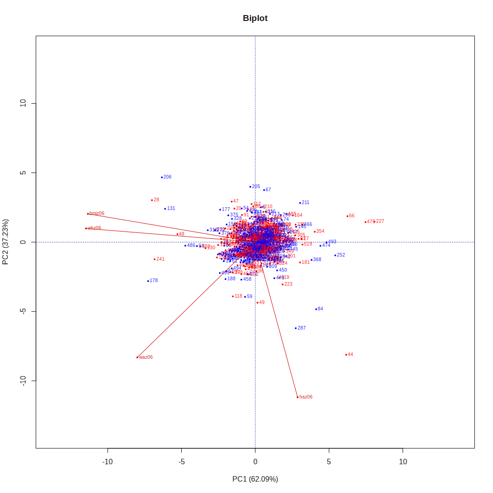
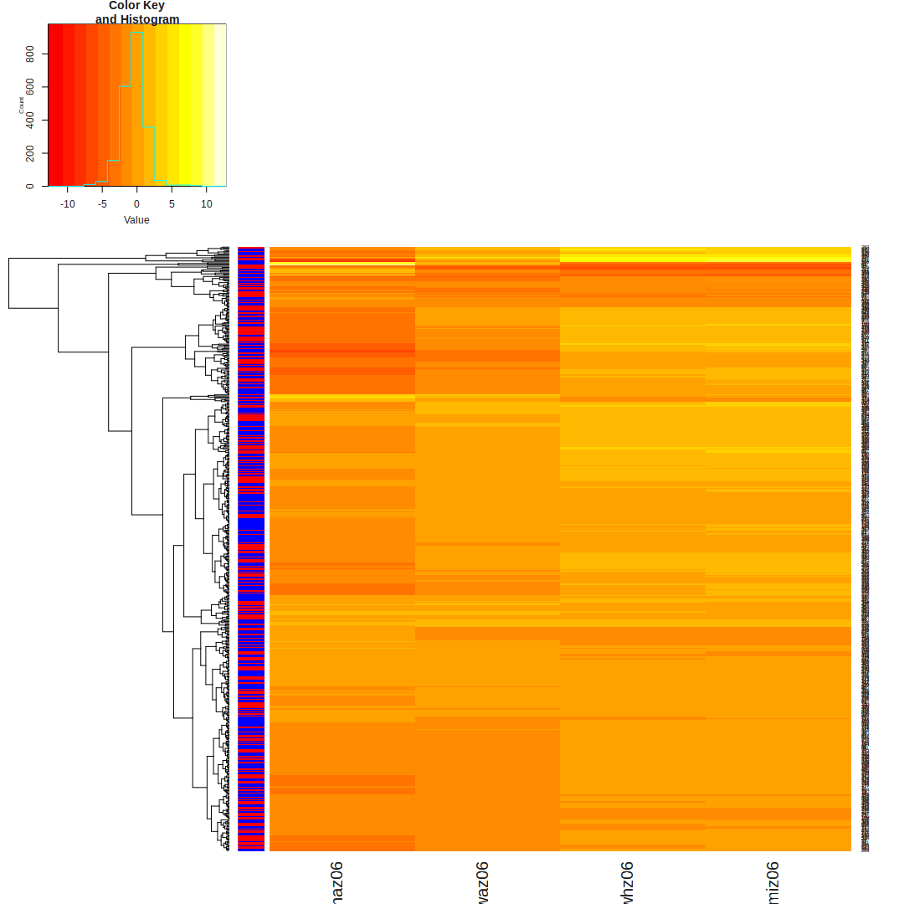

Notes
-----

**Two challenges**:

1.  Hidden hunger

-   Micronutrient (iron, etc.) defficiency - vitamin A, zinc, iodine, iron, folate
-   Dietary diversity

1.  Obesity

-   Obesity as a form malnutrition that is an increasing problem in the developing world.
-   key indicators:
    -   Overweight index
    -   BMI (can calculate from height and weight)
-   agricultural production -\> hunger
-   differences in nutrients for the same amount of calories
-   Macro scale
    -   challenge; how can we extract meaningful infomration from all of the variables in the harvest choice dataset?
-   Micro scale
    -   challenge: aggregate information

Load data
---------

``` r
library('ggplot2')
library('gplots')
library('readr')
library('dplyr')
library('knitr')
library('bpca')

# Malawi
mwi_nutrition = read_csv('./nutrition_indicators/Malawi/mwi_nutrition.csv')
mwi_anthropometry = read_csv('./nutrition_indicators/Malawi/mwi_anthropometry.csv')

# Example rows
kable(t(mwi_anthropometry[1,]))
```

|:-------|:-----------|
| hhid   | 2081111302 |
| pid    | 9          |
| sex    | Female     |
| haz06  | -2.08      |
| waz06  | -1.43      |
| whz06  | -0.59      |
| bmiz06 | -0.25      |
| wa\_m  | 0          |
| wa\_s  | 0          |
| ha\_m  | 1          |
| ha\_s  | 0          |
| wh\_m  | 0          |
| wh\_s  | 0          |

``` r
mwi_anthro_clean = mwi_anthropometry %>% 
    select(-wa_m, -wa_s, -ha_m, -ha_s, -wh_m, -wh_s)

#df2 = mwi_nutrition %>% select(tot_vita_A_cons, tot_zinc_cons, tot_fol_cons,
#                               tot_iron_

# Nutrition deficiencies
nutrition_def = mwi_nutrition %>% select(hhid, hh_weight, contains('def_'))

# Households found in both tables
print("Total number of households:")
```

[1] "Total number of households:"

``` r
length(unique(union(mwi_anthropometry$hhid, mwi_nutrition$hhid)))
```

[1] 1144

``` r
common_households = intersect(mwi_anthropometry$hhid, mwi_nutrition$hhid)

# Remove incomplete rows
mwi_anthro_clean = mwi_anthro_clean[complete.cases(mwi_anthro_clean),]
summary(mwi_anthro_clean)
```

      hhid               pid            sex                haz06       

Min. :2.08e+09 Min. : 2.00 Length:536 Min. :-8.890
 1st Qu.:2.08e+09 1st Qu.: 4.00 Class :character 1st Qu.:-2.578
 Median :2.09e+09 Median : 5.00 Mode :character Median :-1.595
 Mean :2.09e+09 Mean : 5.23 Mean :-1.623
 3rd Qu.:2.09e+09 3rd Qu.: 6.00 3rd Qu.:-0.765
 Max. :2.09e+09 Max. :12.00 Max. :12.780
 waz06 whz06 bmiz06
 Min. :-5.980 Min. :-7.460 Min. :-7.560
 1st Qu.:-1.512 1st Qu.:-0.560 1st Qu.:-0.352
 Median :-0.755 Median : 0.220 Median : 0.420
 Mean :-0.766 Mean : 0.245 Mean : 0.414
 3rd Qu.:-0.035 3rd Qu.: 1.010 3rd Qu.: 1.245
 Max. : 5.180 Max. : 7.480 Max. : 9.270

``` r
# Create combined table
mwi = merge(mwi_anthro_clean, nutrition_def, by='hhid')

mwi[mwi == 'No'] = FALSE
mwi[mwi == 'Yes'] = TRUE

# recode kcal_ae_hh (different from other logical variables)
mwi$def_kcal_ae_hh = ifelse(mwi$def_kcal_ae_hh == 1, TRUE, FALSE)

# save table
write.csv(mwi, 'mwi_combined_def.csv', quote=FALSE, row.names=FALSE)

# Gender colors
gender_colors = ifelse(mwi_anthro_clean$sex == 'Male', 'red', 'blue')

# Numeric part of anthropometry data
antho_clean_mat = as.matrix(mwi_anthro_clean %>% select(haz06, waz06, whz06, bmiz06))

# Biplot
plot(bpca(antho_clean_mat), var.factor=.5, obj.col=gender_colors)
title("Biplot")
```



``` r
# Heatmap
heatmap.2(antho_clean_mat, trace='none', dendrogram='row', RowSideColors=gender_colors)
```



``` r
# Ethiopia
#eth_nutrition = read_csv('./nutrition_indicators/Ethiopia/eth_nutrition.csv')
#eth_anthropometry = read_csv('./nutrition_indicators/Ethiopia/eth_anthropometry.csv')
```
