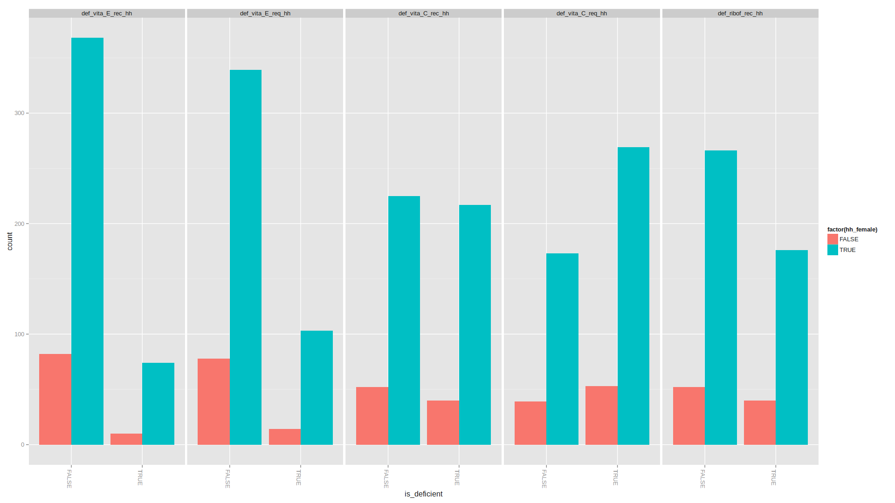

Notes
-----

**Two challenges**:

1.  Hidden hunger

-   Micronutrient (iron, etc.) defficiency - vitamin A, zinc, iodine, iron, folate
-   Dietary diversity

1.  Obesity

-   Obesity as a form malnutrition that is an increasing problem in the developing world.
-   key indicators:
    -   Overweight index
    -   BMI (can calculate from height and weight)
-   agricultural production -\> hunger
-   differences in nutrients for the same amount of calories
-   Macro scale
    -   challenge; how can we extract meaningful infomration from all of the variables in the harvest choice dataset?
-   Micro scale
    -   challenge: aggregate information

Load data
---------

``` r
library('ggplot2')
library('gplots')
library('readr')
library('dplyr')
library('knitr')
library('bpca')
library('reshape2')

# Malawi
mwi_nutrition = read_csv('./nutrition_indicators/Malawi/mwi_nutrition.csv')
mwi_anthropometry = read_csv('./nutrition_indicators/Malawi/mwi_anthropometry.csv')

# Example rows
#kable(t(mwi_anthropometry[1,]))
mwi_anthropometry[1,] %>% glimpse()
```

Observations: 1 Variables: $ hhid (int) 2081111302 $ pid (int) 9 $ sex (chr) "Female" $ haz06 (dbl) -2.08 $ waz06 (dbl) -1.43 $ whz06 (dbl) -0.59 $ bmiz06 (dbl) -0.25 $ wa\_m (int) 0 $ wa\_s (int) 0 $ ha\_m (int) 1 $ ha\_s (int) 0 $ wh\_m (int) 0 $ wh\_s (int) 0

``` r
mwi_anthro_clean = mwi_anthropometry %>% 
    select(-wa_m, -wa_s, -ha_m, -ha_s, -wh_m, -wh_s)

#df2 = mwi_nutrition %>% select(tot_vita_A_cons, tot_zinc_cons, tot_fol_cons,
#                               tot_iron_

# Pull in some of the fields from the nutrition table 
nutrition_def = mwi_nutrition %>% 
    select(hhid, hh_female, hh_weight, contains('def_'), sh_oil_exp,
           sh_meat_exp, sh_milk_exp, foodvalue_totalyr)

# Households found in both tables
print("Total number of households:")
```

[1] "Total number of households:"

``` r
length(unique(union(mwi_anthropometry$hhid, mwi_nutrition$hhid)))
```

[1] 1144

``` r
common_households = intersect(mwi_anthropometry$hhid, mwi_nutrition$hhid)

# Remove incomplete rows
mwi_anthro_clean = mwi_anthro_clean[complete.cases(mwi_anthro_clean),]
summary(mwi_anthro_clean)
```

      hhid               pid            sex                haz06       

Min. :2.08e+09 Min. : 2.00 Length:536 Min. :-8.890
 1st Qu.:2.08e+09 1st Qu.: 4.00 Class :character 1st Qu.:-2.578
 Median :2.09e+09 Median : 5.00 Mode :character Median :-1.595
 Mean :2.09e+09 Mean : 5.23 Mean :-1.623
 3rd Qu.:2.09e+09 3rd Qu.: 6.00 3rd Qu.:-0.765
 Max. :2.09e+09 Max. :12.00 Max. :12.780
 waz06 whz06 bmiz06
 Min. :-5.980 Min. :-7.460 Min. :-7.560
 1st Qu.:-1.512 1st Qu.:-0.560 1st Qu.:-0.352
 Median :-0.755 Median : 0.220 Median : 0.420
 Mean :-0.766 Mean : 0.245 Mean : 0.414
 3rd Qu.:-0.035 3rd Qu.: 1.010 3rd Qu.: 1.245
 Max. : 5.180 Max. : 7.480 Max. : 9.270

``` r
# Create combined table
mwi = merge(mwi_anthro_clean, nutrition_def, by='hhid')

mwi[mwi == 'No'] = FALSE
mwi[mwi == 'Yes'] = TRUE

# recode kcal_ae_hh (different from other logical variables)
mwi$def_kcal_ae_hh = ifelse(mwi$def_kcal_ae_hh == 1, TRUE, FALSE)

dec_types = colnames(mwi)[grepl('def_', colnames(mwi))]
for (x in dec_types) {
    mwi[[x]] = as.logical(mwi[[x]])
}

# Gender colors
gender_colors = ifelse(mwi_anthro_clean$sex == 'Male', 'red', 'blue')

# Numeric part of anthropometry data
antho_clean_mat = as.matrix(mwi_anthro_clean %>% select(haz06, waz06, whz06, bmiz06))
```

Visualization
-------------

### Exploratory data analysis

#### Antropometric data

##### Biplot

``` r
plot(bpca(antho_clean_mat), var.factor=.5, obj.col=gender_colors)
title("Biplot")
```

 \#\#\#\#\# Heatmap

``` r
# Heatmap
heatmap.2(antho_clean_mat, trace='none', dendrogram='row', RowSideColors=gender_colors)
```


``` r
# Ethiopia
#eth_nutrition = read_csv('./nutrition_indicators/Ethiopia/eth_nutrition.csv')
#eth_anthropometry = read_csv('./nutrition_indicators/Ethiopia/eth_anthropometry.csv')
```

### Nutrition

#### BMI vs. gender

``` r
ggplot(mwi, aes(bmiz06, fill=sex)) + geom_density(alpha=0.75)
```


#### BMI relationship to household gender composition?

``` r
# Create columns corresponding to gender ratio in each household
hh_gender_composition = mwi %>%
    group_by(hhid) %>% 
    summarise(num_males=sum(sex == 'Male'), 
              num_females=sum(sex == 'Female')) %>%
    mutate(ratio_female = num_females / (num_females + num_males))

mwi = merge(mwi, hh_gender_composition)

table(mwi$ratio_female)
```

    ## 
    ##                 0 0.333333333333333               0.5 0.666666666666667 
    ##               212                 3                82                 3 
    ##              0.75                 1 
    ##                 4               230

``` r
# BMI by household gender composition (only use ratios for which we have > 5
# data points)
ggplot(mwi %>% filter(ratio_female %in% c(0, 0.5, 0.75)), 
                                aes(def_kcal_req_hh, fill=factor(ratio_female))) + 
    geom_bar(position='dodge')
```


### Female head of household

``` r
# Female head of household
ggplot(mwi, aes(def_kcal_req_hh, fill=factor(hh_female))) + 
    geom_bar(position='dodge')
```


### Micronutrient deficiency by gender of head of household

#### Individual micronutrients (and calories)

``` r
# Deficiencies
mwi_defs = mwi %>% select(hhid, hh_female, contains('def_'))
mwi_defs = melt(mwi_defs, id.vars=c('hhid', 'hh_female'))
colnames(mwi_defs) = c('hhid', 'hh_female', 'deficiency', 'is_deficient')

# Break up and plot
for (group in split(dec_types, ceiling(seq_along(dec_types) / 5))) {
    plt = ggplot(mwi_defs %>% filter(deficiency %in% group), 
           aes(is_deficient, fill=factor(hh_female))) + 
        geom_bar(position='dodge') + facet_grid(.~deficiency) +
        theme(axis.text.x=element_text(angle=-90, hjust = 0))
    print(plt)
}
```

     

#### Aggregate micronutrients

``` r
# most common missing micronutrients
colSums(mwi%>% select(contains('def_')))
```

    ##     def_kcal_rec_hh     def_kcal_req_hh     def_prot_rec_hh 
    ##                  71                 106                 203 
    ##     def_prot_req_hh     def_iron_rec_hh     def_iron_req_hh 
    ##                 216                  11                  71 
    ##     def_zinc_rec_hh     def_zinc_req_hh   def_vita_A_rec_hh 
    ##                  29                  59                 173 
    ##   def_vita_A_req_hh   def_vita_E_rec_hh   def_vita_E_req_hh 
    ##                 227                  84                 117 
    ##   def_vita_C_rec_hh   def_vita_C_req_hh    def_ribof_rec_hh 
    ##                 257                 322                 216 
    ##    def_ribof_req_hh     def_thia_rec_hh     def_thia_req_hh 
    ##                 301                 305                 354 
    ##      def_nia_rec_hh      def_nia_req_hh  def_vita_B6_rec_hh 
    ##                 167                 243                 218 
    ##  def_vita_B6_req_hh      def_fol_rec_hh      def_fol_req_hh 
    ##                 287                  51                  94 
    ##  def_calcium_rec_hh  def_calcium_req_hh def_vita_B12_rec_hh 
    ##                   8                   8                 134 
    ## def_vita_B12_req_hh      def_kcal_ae_hh 
    ##                 134                 429

``` r
# Add a column: missing one or more key micronutrients: Iron, Zinc, Folate, Vitamin A
mwi = mwi %>% mutate(missing_micronutrient=(def_iron_rec_hh == TRUE     | 
                                            def_fol_rec_hh == TRUE      | 
                                            def_calcium_rec_hh == TRUE  | 
                                            def_thia_rec_hh == TRUE     | 
                                            def_vita_A_rec_hh == TRUE   | 
                                            def_vita_B6_rec_hh == TRUE  | 
                                            def_vita_B12_rec_hh == TRUE | 
                                            def_vita_C_rec_hh == TRUE   | 
                                            def_vita_E_rec_hh == TRUE   |
                                            def_zinc_rec_hh == TRUE     |
                                            def_ribof_rec_hh == TRUE
                                            ))

table(mwi$missing_micronutrient)
```

    ## 
    ## FALSE  TRUE 
    ##   126   408

``` r
ggplot(mwi, aes(missing_micronutrient, fill=hh_female)) +
    geom_bar(position='dodge') 
```


``` r
mwi %>% group_by(missing_micronutrient) %>%
    summarise(ratio_female=sum(hh_female == TRUE) / n())
```

    ## Source: local data frame [2 x 2]
    ## 
    ##   missing_micronutrient ratio_female
    ## 1                 FALSE       0.7857
    ## 2                  TRUE       0.8407

``` r
ggplot(mwi, aes(hh_female, fill=missing_micronutrient)) +
    geom_bar(position='dodge') 
```


``` r
mwi %>% group_by(hh_female) %>%
    summarise(ratio_missing=sum(missing_micronutrient == TRUE) / n())
```

    ## Source: local data frame [2 x 2]
    ## 
    ##   hh_female ratio_missing
    ## 1     FALSE        0.7065
    ## 2      TRUE        0.7760

``` r
# save table
write.csv(mwi, 'output/mwi_combined.csv', quote=FALSE, row.names=FALSE)
```

### Gender / food groups

``` r
ggplot(mwi, aes(missing_micronutrient, sh_meat_exp, color=hh_female)) + 
    geom_point() +
    geom_point(position="jitter")
```

    ## Warning in loop_apply(n, do.ply): Removed 287 rows containing missing
    ## values (geom_point).

    ## Warning in loop_apply(n, do.ply): Removed 287 rows containing missing
    ## values (geom_point).


